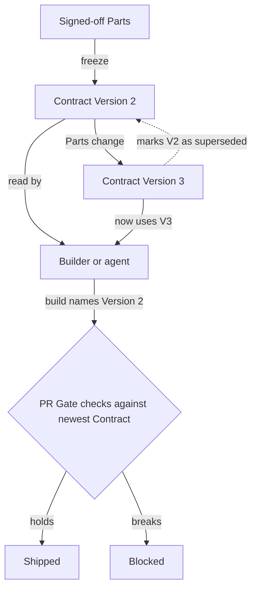
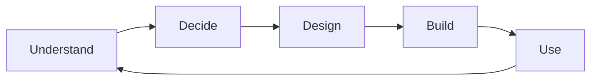
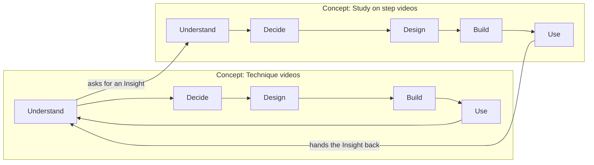
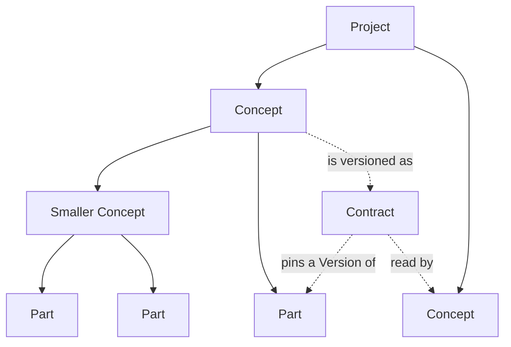
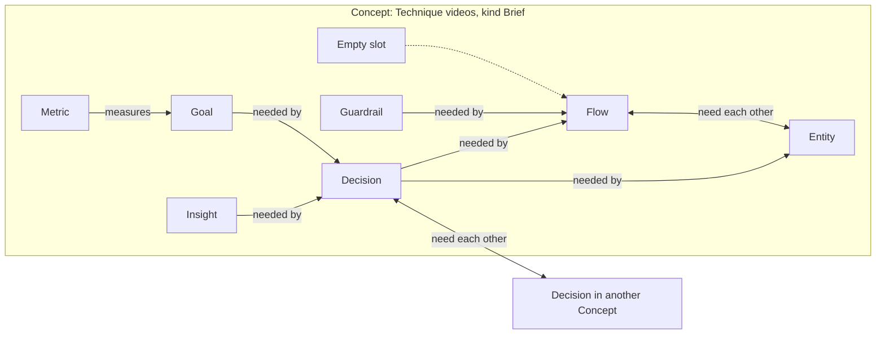
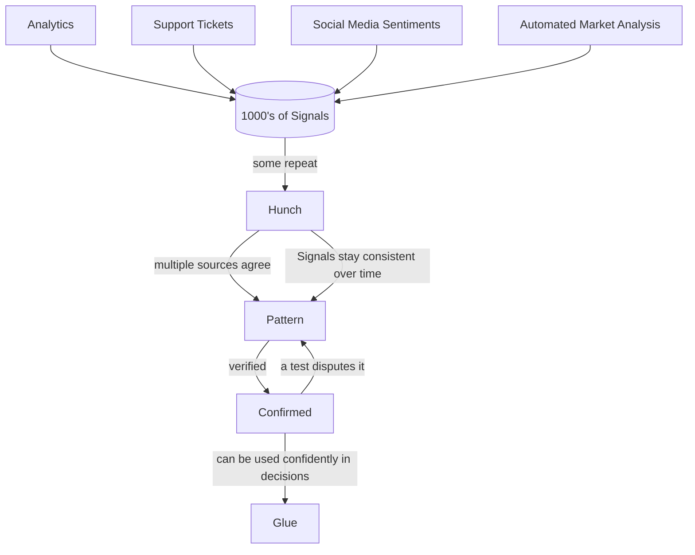
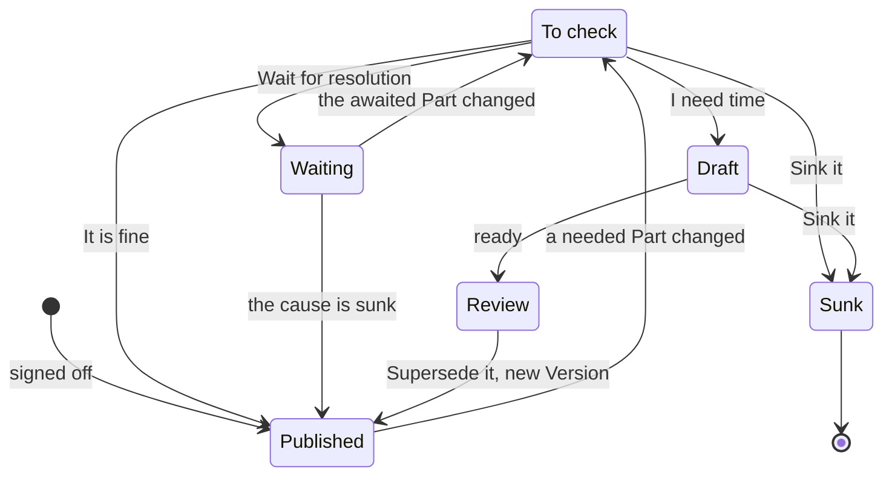
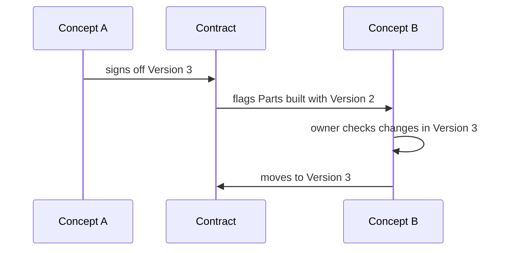
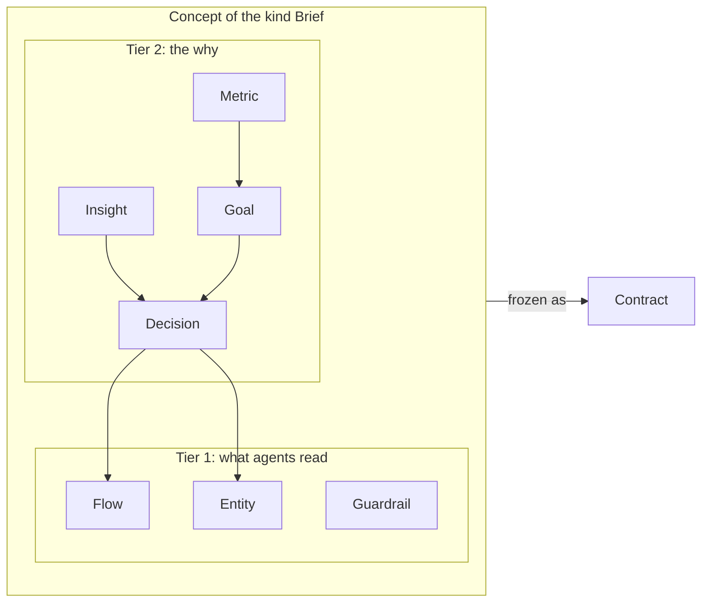
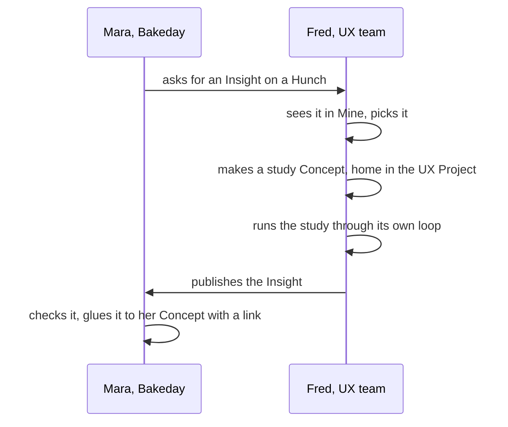

# Glue: the concept

Glue keeps the why of a product. Each choice is a record that knows which records it is glued to. When one changes, one person must react.

## The three core principles

| Principle                       | Means                                                                   | Gives you                                 |
| ------------------------------- | ----------------------------------------------------------------------- | ----------------------------------------- |
| structured, enforceable Concept | complete WHY, checked at build                                          | Builds match intent                       |
| Parts glue to Parts             | Simple modular building blocks                                          | Adaptability to your needs                |
| Work happens in loops           | Understanding → deciding → designing → building → using → understanding | Concepts adapt live, builds stay relevant |

Your concept is versioned, and your code knows the Version it was built with. Understanding the WHY builds the context for your agent to align its decisions with your goals. Gates enforce the contracts are followed.

## 1. The loop

Projects and products loop, features don't end until they are removed. What you learn from use becomes new evidence for your next decisions.

Any work moves through these steps. A step is not a job role. Each Concept runs its own loop, and loops nest.

| Step       | You do                     | Most common Parts         | Done when               |
| ---------- | -------------------------- | ------------------------- | ----------------------- |
| Understand | Bring evidence in          | Insight                   | Level is set            |
| Decide     | Choose and say why         | Goal, Decision, Guardrail | Owner signs off         |
| Design     | Describe the build         | Flow, Entity              | Handed on               |
| Build      | Build from the Contract    | Questions, answers        | Shipped                 |
| Use        | Read Metric against target | Metric                    | Reading becomes Insight |

## 2. Core Entities

A Project holds Concepts ->
A Concept is assembled from Parts, with glue to hold them together. It can hold smaller Concepts ->
A Contract is the versioned Concept everyone follows.

| Thing    | What it is                 | Holds                | Example          |
| -------- | -------------------------- | -------------------- | ---------------- |
| Project  | One whole project/product  | Concepts             | Bakeday          |
| Concept  | Parts assembled with glue  | Parts, Concepts      | Technique videos |
| Part     | One record                 | Its content          | A Decision       |
| Contract | One frozen Concept Version | Pinned Part Versions | "Must not: Ship" |
| Version  | A signed-off state         | One frozen Part      | Version 2        |
| Kind     | Slots a Concept must fill  | Required Part types  | Brief, PRD       |

A Brief is a kind of Concept, not a Part.

## 3. Part types

Glue offers different parts you can combine to describe your project.

| Type      | Question it answers | Most common Loop step | Example                      |
| --------- | ------------------- | --------------------- | ---------------------------- |
| Insight   | What do we know?    | Understand            | Bakers want step videos      |
| Goal      | Where do we go?     | Decide                | First bake feels easy        |
| Decision  | What do we choose?  | Decide                | Show the creator's video     |
| Guardrail | What must hold?     | Decide, Design, Build | Only creator's own videos    |
| Entity    | What things exist?  | Design, Build         | Technique                    |
| Flow      | How does it move?   | Decide, Design        | Watch technique while baking |
| Metric    | Did it work?        | Use, Decide           | Ease of first bake           |

A Part can be used in any step.

## 4. How Parts hold together

Parts are glued in a web, not a stack. A joint can go sideways and into another Concept. A Part is only as sure as the weakest Part it needs.

| Joint      | Reads as                  | A change travels |
| ---------- | ------------------------- | ---------------- |
| One-way    | A needs B                 | From B to A      |
| Two-way    | Both need each other      | Both ways        |
| Empty slot | A needs something missing | A stays unsure   |

## 5. How evidence grows

Evidence comes in as noisy signals. Glue searches for hunches and patterns, and calms the noise down. Many Signals become few Insights. You can add your own filters.

| Level     | How many  | Means                 | Build on it? |
| --------- | --------- | --------------------- | ------------ |
| Signal    | Thousands | One raw observation   | No           |
| Hunch     | Some      | A first guess         | Not yet      |
| Pattern   | Few       | Several sources agree | With care    |
| Confirmed | Very few  | Tested and holds      | Yes          |

## 6. Trust and work state

Trust is for the reader: a light. Work state is for the owner: a word.

| Light  | Word      | Means                   | Set by                  |
| ------ | --------- | ----------------------- | ----------------------- |
| Green  | Solid     | Rely on it              | Owner signs off         |
| Yellow | Flagged   | Look out, reason listed | Automatic, one step far |
| Red    | Not ready | Do not rely on it       | Owner, on purpose       |
| Black  | Wrong     | Wrong or discontinued   | Owner, on purpose       |

| Work state | Means                     | In Mine? |
| ---------- | ------------------------- | -------- |
| To check   | A new flag, not seen      | Yes      |
| Waiting    | Seen, waits on named Part | No       |
| Draft      | Owner works on it         | Yes      |
| Review     | Waits for sign-off        | Yes      |
| Published  | A Version is out          | No       |

| Answer              | Trust after        | Work state after |
| ------------------- | ------------------ | ---------------- |
| It is fine          | Green              | Published        |
| Wait for resolution | Stays yellow       | Waiting          |
| I need time         | Stays yellow       | Draft            |
| Mark not ready      | Red                | Draft            |
| Supersede it        | Green, new Version | Published        |
| Sink it             | Black              | Sunk             |

A flag goes only to a person who can act.

| Rule                     | Means                      |
| ------------------------ | -------------------------- |
| Old is not wrong         | Behind, not broken         |
| Only trust travels       | Work state is a note       |
| Inside a Concept         | Trust travels along glue   |
| Across a Concept edge    | Only when published        |
| Automatic is yellow only | Red is a person's choice   |
| One step far             | Next owner decides further |
| A flag lists its reasons | New reason, new notice     |

The cases for a Design System Pattern:

| Case                       | UX team does        | Other teams see           | Notice?         |
| -------------------------- | ------------------- | ------------------------- | --------------- |
| Insight may change Pattern | Starts a review     | Green, with a note        | No              |
| Review finds nothing       | Sinks the Insight   | Note goes away            | No              |
| Review changes the Pattern | Publishes Version 3 | Yellow: new Version       | Yes, once       |
| Pattern can not be trusted | Marks Version 2 red | Yellow: base not ready    | Yes, once       |
| Other owner clicks wait    | Nothing             | Yellow, Waiting, off Mine | No              |
| UX team resolves it        | Publishes or sinks  | To check, or green        | Yes, if changed |
| Pattern is plain wrong     | Sinks Version 2     | Yellow: base is wrong     | Yes, now        |
| Second reason while yellow | Nothing             | Reason added to list      | Yes, again      |

## 7. Tiers and common flows

Tier 1 is what a coding agent reads. Tier 2 is the why. A Brief needs both.

Each common flow shows as a step bar with the one next step.

| Flow                | Starts with     | Steps                      | Ends with           |
| ------------------- | --------------- | -------------------------- | ------------------- |
| Evidence to Insight | Signals         | Group, check, verify       | Confirmed Insight   |
| Insight to Decision | An Insight      | Set Goal, choose, sign     | Signed-off Decision |
| Decision to Brief   | A Decision      | Fill the Brief's slots     | Signed-off Brief    |
| Brief to build      | A Brief         | Version, build, gate       | Shipped build       |
| Use to Insight      | A shipped build | Read Metric against target | New Insight         |
| Ask another team    | A Hunch         | Ask, pick, hand back       | Glued Insight       |
| React to a change   | A flag          | Check, answer              | Solid Part again    |

## 8. People

Every Part has one owner, many can watch it. Watching is not owning. An agent is a user too.

| Person          | Opens first | Wants                   |
| --------------- | ----------- | ----------------------- |
| Product owner   | Work        | What needs a decision   |
| Designer        | A Part      | Insights and Guardrails |
| Developer       | A Concept   | Specs and past answers  |
| Researcher      | Signals     | Where evidence led      |
| Marketer        | Signals     | Where evidence led      |
| AI coding agent | A Contract  | What to build, ask      |

## 9. High Level Navigation

Each app section answers one question. What you are shown inside each section is filtered by your loop steps and your assigned Concepts. Currently we do not have access roles so everyone has access to everything.

| Section    | Question it answers               | Main action                                 |
| ---------- | --------------------------------- | ------------------------------------------- |
| Mine       | What needs me now?                | React to a Notification                     |
| Understand | What Signals comes in             | Generate Insights                           |
| Decide     | Where are we going                | Set the direction with Goals                |
| Design     | What are we building              | Start the brief with the conceptual details |
| Build      | How are we building it            | add the architecture to the brief           |
| Use        | TBD                               | TBD                                         |
| People     | Who is currently working on what? | Find an owner                               |

## 10. Member Structure and Flight Level

Each member picks their usual loop steps. No data is hidden.

| Assigned as | Means                 | On              |
| ----------- | --------------------- | --------------- |
| Responsible | Main point of contact | Concepts, Parts |
| Co-Author   | Also works on it      | Concepts, Parts |

| Flight level | Shows                   | You see it when             |
| ------------ | ----------------------- | --------------------------- |
| Strategic    | Summary of key aspects  | All other Concepts          |
| Operational  | Raw details, less prose | Your loop step, or assigned |

## 11. Home, lens and work across teams

Each Part has one home.

| Word | What it is              | Decides                |
| ---- | ----------------------- | ---------------------- |
| Home | The Part's one Concept  | Owner, later access    |
| Lens | A filter over all Parts | What you see first     |
| Link | Glue across an edge     | Nothing moves, no copy |

## 12. Details to keep

| Detail                         | Where it goes                 |
| ------------------------------ | ----------------------------- |
| Step bar per flow              | Top of each Part              |
| "Next:" box, one button        | Every state, not only flagged |
| Metric against a target        | Use step, on Decisions        |
| One activity list              | Replaces the Versions section |
| Checksum on a Contract Version | Contract view                 |
| Stale build mark               | Builds on an old Version      |
